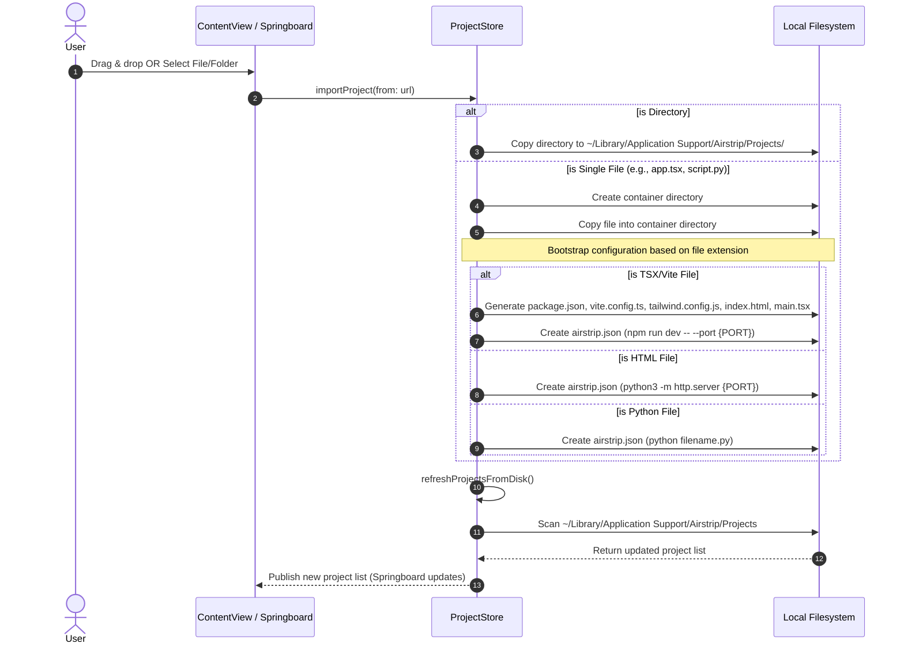

# Airstrip Project Import & Bootstrapping Workflow

This document details the architecture and step-by-step logic Airstrip uses to import and bootstrap automation projects (directories and files) for React/Vite, HTML static pages, and Python scripts.

---

## 1. Import Step-by-Step

When a project or file is imported into Airstrip:

1. **User Drag & Drop / Selection**: User drops a folder or file, or clicks the toolbar "+" import button (which opens `importWithPanel` allowing files & directories).
2. **Project Store Processing**: `importProject(from:)` is called.
3. **Directory Verification & Isolation**:
   - If it's a folder, it is copied directly to `~/Library/Application Support/Airstrip/Projects/[FolderName]`.
   - If it's a single file, Airstrip creates a unique folder under `Projects/` and copies the file inside it.
4. **Bootstrapping**:
   - **Vite/React Files (`.tsx`/`.jsx`/etc)**: Airstrip creates standard templates (`package.json`, `vite.config.ts`, `postcss.config.js`, `tailwind.config.js`, `index.html`, `src/main.tsx`, `src/index.css`) and generates `airstrip.json` to launch it using `npm run dev -- --port {PORT}`.
   - **HTML Static Files**: Generates `airstrip.json` to serve it using Python's `http.server` on `{PORT}`.
   - **Python Files**: Generates `airstrip.json` to run the file directly under the project-local virtual environment.
5. **Action Inference (No Manifest)**:
   - If a folder has no `airstrip.json`, `inferredActions(from:)` automatically detects:
     - Node projects (having `package.json`) $\rightarrow$ executes `npm run dev -- --port {PORT}`.
     - HTML static projects (having `index.html`) $\rightarrow$ executes `python3 -m http.server {PORT}`.
     - Falls back to running `main.py`, `app.py`, or similar using local Python venv.

---

## 2. Sequence Diagram

The following sequence diagram outlines the interaction between the user interface, the project store manager, and the local filesystem during an import operation:

